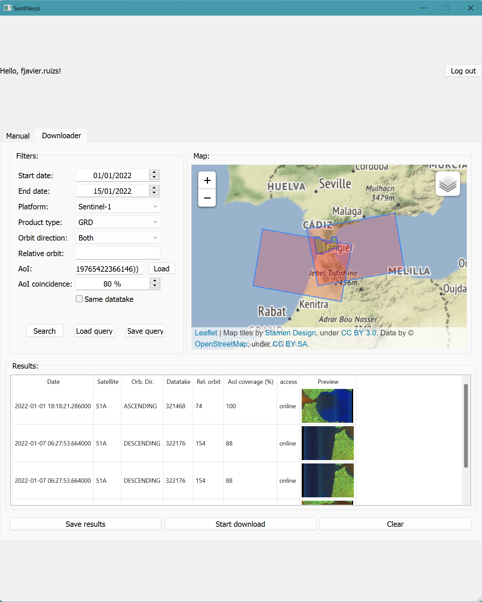

# SentiVessi

Desktop Application for Downloading and Launching Processing Chains for Vessel Detection on SAR Images.



## Brief Introduction

This development is part of my Bachelor's Thesis. SentiVessi is an app that allows users to search for and download
Sentinel-1 products and launch processing chains that detect vessels and create visual change detection images. The app
is written in Python 3.8, uses _snappy_, SNAP's Python API, and a GUI created with PyQt5.

## Compatibility

SentiVessi has been run on Ubuntu 20.04 LTS, and on both Windows 10 and 11. However, since the development has been done
mainly on Windows, the setup guide that follows will only cover the needed steps to make it run on Windows. Ubuntu are
essentially the identical. Here, the shortcut to a conda initiated terminal that only exists for Windows, Anaconda
Prompt, can be replaced with a console that has conda initiated, or has conda bins accessible from the system's path.

## Pre-Requirements

Besides from cloning this repository, it is required to have [Anaconda3](https://www.anaconda.com/products/distribution)
and the [Sentinel-1 Toolbox](https://step.esa.int/main/download/snap-download/) installed. For the Sentinel-1 toolbox,
you must skip the Python setup step, as the version used is not compatible with SNAP's installer. Snappy's installation
is a manual procedure and will be described next.

## Step 1: Create a Python Environment

Open Anaconda Prompt from your start menu. Change directory (_cd_ command) to the repository's root directory. Run the
following command:

```cmd
conda env create -f conda_envs\environment.yml -p .\sentinel
```

This command will create a Python virtual environment with the listed packages on the ```conda_envs\environment.yml```
file inside the project's directory under the name ```sentinel```.

Run the following command to activate it, as it is needed for the next steps.

```cmd
conda activate .\sentinel
```

## Step 2: Create the _snappy_ Bundle/Package for Python 3.8

When using versions 2.7, 3.4 and 3.6, the installation is simpler than what is about to be explained here. Snappy
depends on the [JPY](https://github.com/jpy-consortium/jpy) wheel, and for the mentioned versions it is bundled with
SNAP. For more recent versions, manual compilation is required. Follow JPY's steps on how to do it yourself, although it
is not necessary if you own a Intel Core machine. Wheels for Windows and Ubuntu have been included in
folder ```snap-python\snappy```. They have been tested on two different machines, both having Intel Core i9 processors.

Run the following command:

```cmd
snappy-conf.bat <Absolute Path>\sentinel\python.exe <Absolute Path>\snap-python
```

Replace ```<Absolute Path>``` with the full path displayed before the ```>``` symbol.

Perhaps you may encounter with error 30 after running the command. It is nothing to worry about, since it results from
trying to importing test. Make sure, however, by opening the displayed log file, that the error occurrs after _"
Importing snappy for final test..."_

If the installer doesn't display any error, but does not finish automatically after stating that the process has been
completed, you can simply exit by pressing ```Ctrl+C```.

## Step 4: Installing _snappy_

Now it's time for installing the just created _snappy_ bundle in our virtual environment. To do so, run:

```cmd
pip install .\snap-python\snappy
```

## Step 5: Run SentiVessi and OAHretriever:

OAHretriever is a simple CLI script that downloads products retrieved with SentiVessi. Generally, SentiVessi generates a
CSV file with product details, being their UUIDs the row indices. OAHretriever reads these files and starts the offline
download process and allows interruptions.

To run either one, simply type this:

```cmd
python .\sentivessi.py  # Replace the script name for the one of your choosing.
```

There is a file named `login_cfg.ini` that saves credentials so the process is 
quicker. Before using it, replace the marked fiels with your values.

## Special Thanks and Credits

- For the inspiration of the Downloader tab and the pixel-scaling process: [satcen-better-hackaton-2020](https://github.com/ec-better/hackathon-2020-satcen)
- For the change detection processing chain: [Step-by-Step: Mudslides and Associated Flood Detection Using Sentinel-1 Data](https://www.un-spider.org/advisory-support/recommended-practices/mudslides-flood-sentinel-1/step-by-step)
- For the vessel detection processing chain: [OCEA01](https://rus-copernicus.eu/portal/wp-content/uploads/library/education/training/OCEA01_ShipDetection_Trieste.pdf)
- For the icons: [FlatIcon](https://www.flaticon.es/iconos-gratis/satelite)
